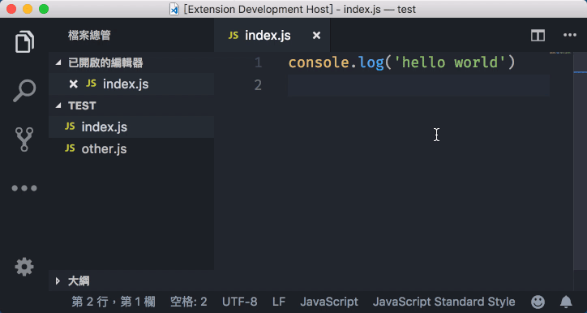

# Insert use strict

This is a VS Code extension which inserts `'use strict'` statement to all JavaScript files (`*.js`, `*.ts`, `*.jsx`) across your workspace.

## Introduction

Putting a `'use strict'` statement to the begining of a JavaScript file enables ECMAScript 5's strict mode. Read [this article from MDN](https://developer.mozilla.org/en-US/docs/Web/JavaScript/Reference/Strict_mode) if you don't know what it is.

This extension is supposed to be used in Node.js projects only. For front end projects if you use transpilers like Webpack or Rollup, they add the `'use strict'` statement to the output automatically.

## Features

- Scan the content of file so that it won't do anything if the file already contains the `'use strict'` statement
- Configurations (single quote or double quote, use a semicolon or not) for different coding styles

## Usage

Open command palette (Mac `⇧⌘P`, Windows `Ctrl+Shift+P`), search for `Insert "use strict" in workspace`, press Enter.

## Extension Settings

This extension contributes the following settings:

- `insertUseStrict.useDoubleQuote`: Use single/double quote. (default: `false`)
- `insertUseStrict.addTrailingSemicolon`: Add semicolon at the end of the statement. (default: `false`)
- `insertUseStrict.autoSave`: Save the documents automatically after editing (default: `true`)

## Release Notes

### 1.0.2

Add logo

### 1.0.0

Initial Release

---

Feel free to submit issues or pull requests. Enjoy!
